# Автор: Федорчук Дмитрий Сергеевич DEVOPS-33

# Домашнее задание к занятию «Введение в Terraform»

Уже давно, на первых занятиях был установлен Terraform из зеркала https://registry.comcloud.xyz/, а также был установлен Yandex.Cloud Provider.

Версия Terraform на скриншоте ниже:

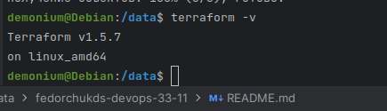

### Задание 1

1. Перейдите в каталог [**src**](https://github.com/netology-code/ter-homeworks/tree/main/01/src). Скачайте все необходимые зависимости, использованные в проекте. 
2. Изучите файл **.gitignore**. В каком terraform-файле, согласно этому .gitignore, допустимо сохранить личную, секретную информацию?
3. Выполните код проекта. Найдите  в state-файле секретное содержимое созданного ресурса **random_password**, пришлите в качестве ответа конкретный ключ и его значение.
4. Раскомментируйте блок кода, примерно расположенный на строчках 29–42 файла **main.tf**.
Выполните команду ```terraform validate```. Объясните, в чём заключаются намеренно допущенные ошибки. Исправьте их.
5. Выполните код. В качестве ответа приложите: исправленный фрагмент кода и вывод команды ```docker ps```.
6. Замените имя docker-контейнера в блоке кода на ```hello_world```. Не перепутайте имя контейнера и имя образа. Мы всё ещё продолжаем использовать name = "nginx:latest". Выполните команду ```terraform apply -auto-approve```.
Объясните своими словами, в чём может быть опасность применения ключа  ```-auto-approve```. В качестве ответа дополнительно приложите вывод команды ```docker ps```.
8. Уничтожьте созданные ресурсы с помощью **terraform**. Убедитесь, что все ресурсы удалены. Приложите содержимое файла **terraform.tfstate**. 
9. Объясните, почему при этом не был удалён docker-образ **nginx:latest**. Ответ **обязательно** подкрепите строчкой из документации [**terraform провайдера docker**](https://docs.comcloud.xyz/providers/kreuzwerker/docker/latest/docs).  (ищите в классификаторе resource docker_image )


### Решение 1
1. Склонировал репозиторий домашнего задания:

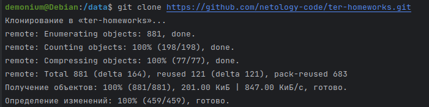

Проверяю содержимое каталога ***src***. Из зависимостей в файле main.tf вижу только Terraform версии 0.13 или более новую, но не ниже и kreuzwerker/terraform-provider-docker версии 3.0 или выше.

Находясь в каталоге с файлом ***main.tf*** командой ```terraform init``` произвожу инициализацию рабочего каталога и скачиваю зависимости, указанные в файле:

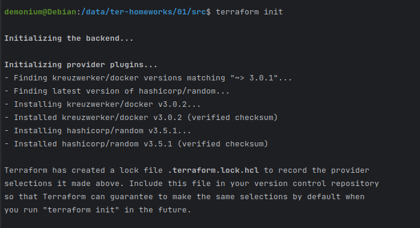

2. Изучаю файл **.gitignore**. Этот файл необходим для указания списка других файлов или папок, которые Git будет игнорировать при работе. Возможно применение внутри файла шаблонов, например, .tfstate.*.
В данном конкретном файле **.gitignore** указан файл ***personal.auto.tfvars*** как возможное хранилище для секретной информации.


3. Выполняю код из файла ***main.tf*** командой ```terraform apply``` на вопрос отвечаю yes:

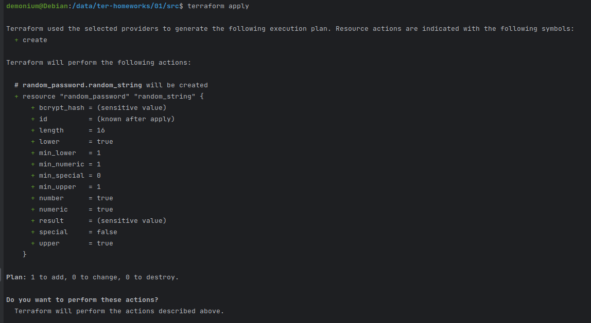

Проверяю файл terraform.tfstate, в который записалась информация после выполнения кода Terraform. Был создан 16-изначный случайный пароль, в котором минимальное количество символов в нижнем регистре равно 1, минимальное количество символов в верхнем регистре равно 1, минимальное количество цифр равно 1. Каждый раз пароль будет уникальным, т.к. есть условия рандомности.

В результате был создан пароль в ключе "result":

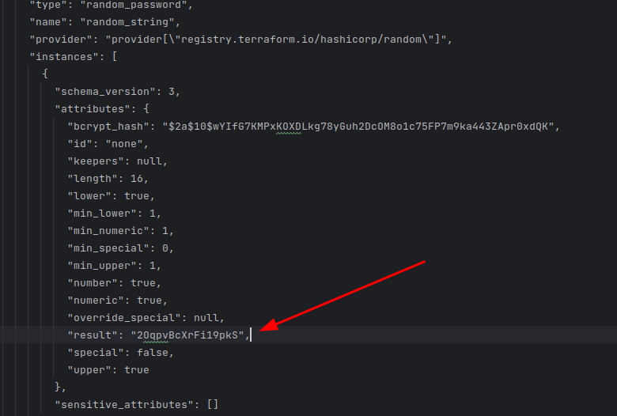

4. Раскомментировал блок кода, расположенный на строках 24 - 37. Командой ```terraform validate``` проверяю код, который будет выполняться при запуске ```terraform apply```.

Нашел следующие ошибки в коде:

* Не было указано имя ресурса docker_image, написал nginx: ***resource "docker_image" "nginx" {***
* Имя контейнера Docker было написано неправильно - 1nginx, правильный вариант: ***resource "docker_container" "nginx" {***
* В строке name  = "example_${random_password.random_string_FAKE.resulT}" ***_FAKE*** оказалось лишним, т.к. создавался ресурс ***resource "random_password" "random_string" {***
и ключ resulT написан с буквой T в верхнем регистре, должно быть написано с буквой в нижнем регистре.

Исправленный фрагмент кода выглядит так:

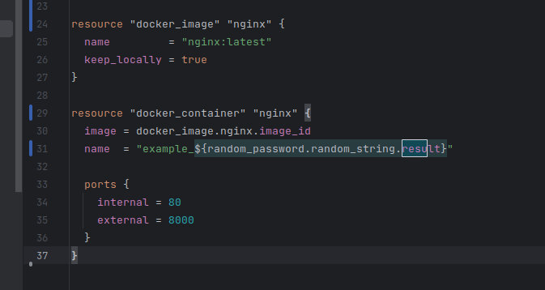

5. Выполняю исправленный код. В результате получаю запущенный контейнер nginx с именем example_2OqpvBcXrFi19pkS:

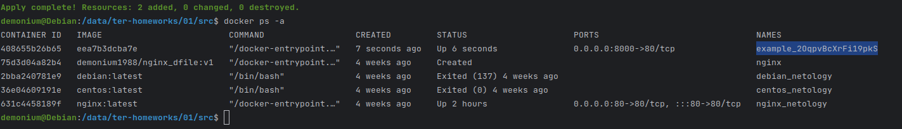

6. Меняю в блоке ***resource "docker_container" "nginx" {*** имя контейнера на ***hello_world*** и выполняю команду ```terraform apply -auto-approve```:

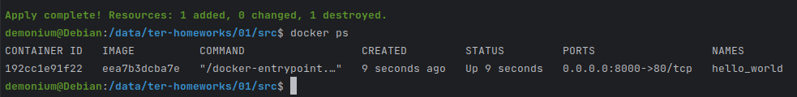

В итоге получаю следующее: так как используется один и тот же образ, контейнер с именем ***example_2OqpvBcXrFi19pkS*** был удален и был создан контейнер с именем ***hello_world***.

Опасность команды ```terraform apply -auto-approve``` заключается в том, что будет выполняться пропуск планирования ресурсов и вопрос о применении кода не будет задан, что грозит риском потерять уже развернутые ресурсы. В моем случае был удален контейнер и создан новый.

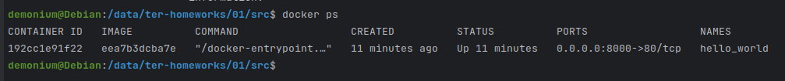

7. Командой ```terraform destroy``` уничтожаю все ресурсы, на вопрос отвечаю yes и вижу, что все описанные в main.tf ресурсы уничтожены:

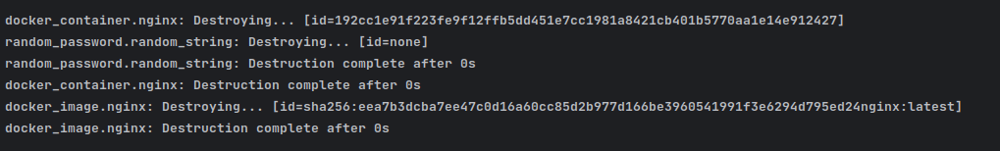

Файл ***terraform.tfstate*** принял следующий вид:

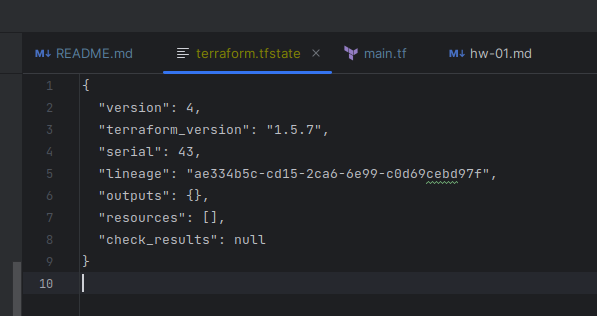

Но при этом создался файл ***terraform.tfstate.backup***, содержащий в себе данные до уничтожения ресурсов.

8. Образ ***nginx:latest*** не был удален потому, что в описании ресурса образа есть настройка удержания образа ***keep_locally = true***.

------

### Задание 2*

1. Изучите в документации provider [**Virtualbox**](https://docs.comcloud.xyz/providers/shekeriev/virtualbox/latest/docs) от 
shekeriev.
2. Создайте с его помощью любую виртуальную машину. Чтобы не использовать VPN, советуем выбрать любой образ с расположением в GitHub из [**списка**](https://www.vagrantbox.es/).

В качестве ответа приложите plan для создаваемого ресурса и скриншот созданного в VB ресурса. 

------